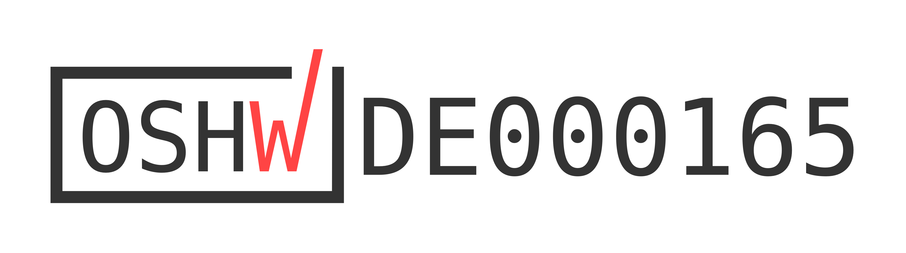
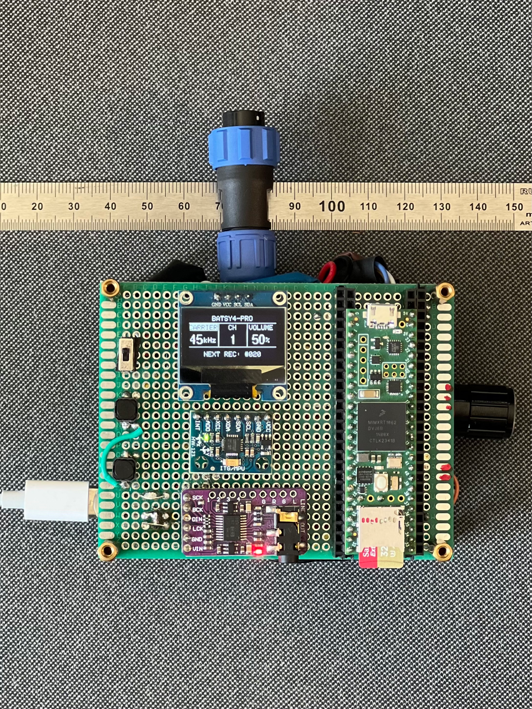

# Batsy4-Pro - Multichannel Ultrasonic Recorder

  

## Overview

**BATSY4-PRO** is a high-rate (192 kHz) ultrasonic audio capture and monitoring system built on **Teensy 4.x** with the **Teensy Audio Library** and an SSD1306 OLED UI.  
It combines live heterodyne monitoring, a rolling 5-second multi-channel ring buffer, and one-touch SD capture.

The current firmware is **version 1.1.0**.

Originally designed for bat acoustics work, this code can be adapted for other ultrasonic or high-speed audio projects.

---

## Features

- **Live Heterodyne Monitoring**
  - Converts the selected ultrasonic input channel to audible output using a carrier oscillator.
  - Monitoring input is selectable from channels 1-4 without altering the four-channel recording.
  - Adjustable carrier frequency (10–85 kHz).
  - Adjustable output gain (0–100%).

- **Rolling 5-Second, 4-Channel Ring Buffer**
  - Stored in EXTMEM (PSRAM) for high-speed operation.
  - Captures “pre-record” data before you press record.

- **One-Touch Capture to SD**
  - **Tap Button** → save last 5 seconds to WAV.
  - **Hold Button** → save 5 seconds pre-buffer + up to 10 seconds live.

- **OLED User Interface**
  - Separate **CARRIER**, **CH**, and **VOLUME** sections use a clear highlighted selection state.
  - Pressing the rotary encoder cycles through the three controls; rotation adjusts the selected value.
  - Displays the next available WAV number after checking the SD card at startup.
  - Recording and saved screens show the corresponding filename.
  - The saved confirmation remains visible for two seconds without pausing audio queue servicing.

---

## Controls

| Control                   | Function                                                     |
| ------------------------- | ------------------------------------------------------------ |
| **Rotary Encoder (SW)**   | Cycle through **CARRIER**, **CH**, and **VOLUME**.            |
| **Rotary Encoder Rotate** | Adjust the currently highlighted control.                    |
| **Tap Button**            | Save last 5 seconds from buffer.                             |
| **Hold Button**           | Save 5 seconds pre-buffer + live forward capture (up to 10 seconds). |

---

## Wiring (Teensy 4.x)

| Component        | Pin(s)   | Notes                               |
| ---------------- | -------- | ----------------------------------- |
| **OLED SSD1306** | SDA/SCL  | I²C @ 0x3C, internal pull-ups OK    |
| **Hold Button**  | 40       | Active-LOW, `INPUT_PULLUP`          |
| **Tap Button**   | 41       | Active-LOW, `INPUT_PULLUP`          |
| **Encoder A**    | 36       | `INPUT_PULLUP`                      |
| **Encoder B**    | 37       | `INPUT_PULLUP`                      |
| **Encoder SW**   | 38       | `INPUT_PULLUP`                      |
| **Encoder COM**  | GND      |                                     |
| **SD**           | Built-in | Teensy 4.1 onboard slot recommended |

---

## File Format

- **WAV** — 16-bit PCM, 4 channels interleaved, 192000 Hz.
- Temporary file: `/TEMP.WAV` (renamed on close).
- The selected monitoring channel is used only for heterodyne playback; all four raw channels are recorded.

---

## Performance Notes

- Use a **fast SD card** (Class 10 or better) for reliable 192 kHz writes.
- Ring buffer in EXTMEM prevents RAM starvation at high sample rates.
- If encoder direction feels reversed, invert direction in `loop()`.

---

## Limitations

- No digital filtering on heterodyne output — add LPF if needed.
- Output is mono (duplicated to L/R), derived from the selected monitoring channel.
- Encoder is polled, so rapid spins during SD writes may miss steps.

---

## Example Data

See folder `field_recordings` for bat call sequences recorded using the Batsy4-Pro

## License

### Hardware
The hardware is licensed under the  
**CERN Open Hardware Licence Version 2 – Strongly Reciprocal (CERN-OHL-S)**.

### Software
The firmware and software are licensed under the  
**GNU General Public License v3.0 (GPL-3.0-only)**.

### Documentation
All documentation, including this README, build instructions, and figures, is licensed under the  
**Creative Commons Attribution–ShareAlike 4.0 International (CC-BY-SA-4.0)**.

---

## Disclaimer

This code is provided **"as is"** without any warranties, express or implied.  
The author makes no guarantee regarding correctness, safety, or suitability for any of your particular purposes.  
You are responsible for testing and validating the code before use — especially in safety-critical or regulatory applications.

Use at your own risk.

<h2>☕ Support my open science projects</h2>

This project is developed and maintained independently as part of my open research work.
If you find it useful and would like to support continued development, documentation,
and free public releases, consider buying me a coffee.

<a href="https://buymeacoffee.com/raviumadi"
   target="_blank"
   style="
     display: inline-block;
     padding: 10px 16px;
     background-color: #FFDD00;
     color: #000;
     font-weight: 600;
     border-radius: 6px;
     text-decoration: none;
     border: 1px solid #e6c800;
   ">
  ☕ Buy me a coffee
</a>

<em>All tools remain free for academic and research use.</em>

