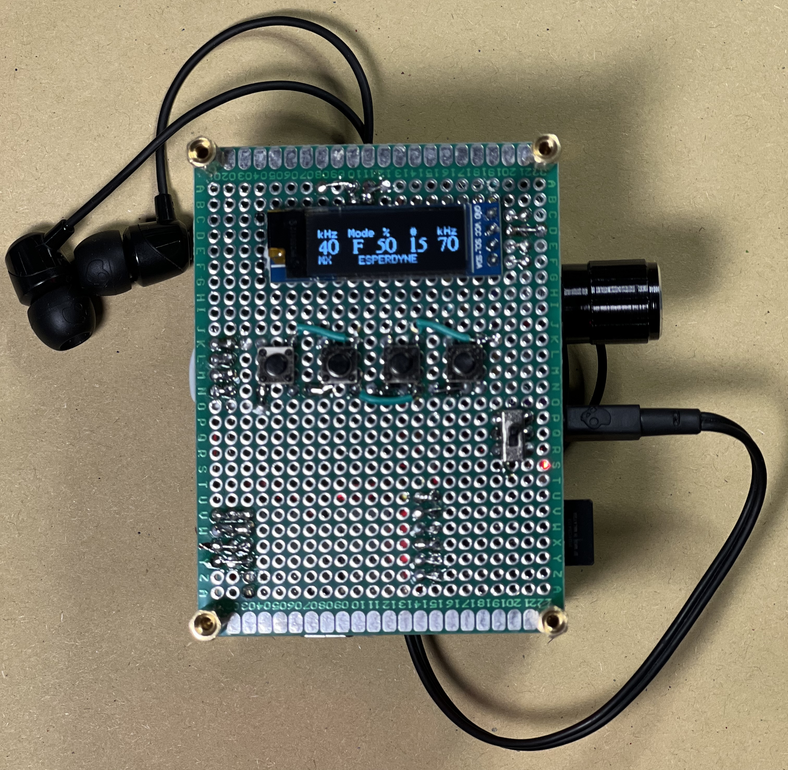
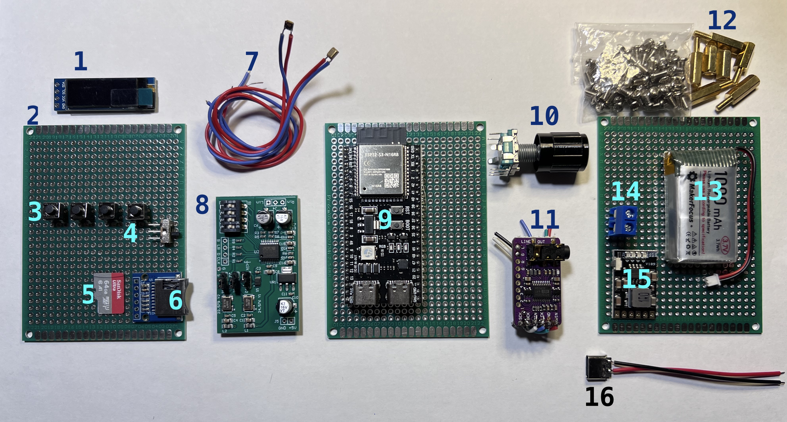

# **ESPERDYNE — Ring Buffer & Dual-Channel Heterodyne (v1.1)**

A pocketable, real-time heterodyne bat-call listener and “tap-to-save” field recorder built on ESP32-S3.


**Licence:** See License file • **Author:** Ravi Umadi • **Date:** August 2025

## **What is ESPERDYNE?**

ESPERDYNE is a high-fidelity, open-hardware/open-code bat detector for fieldwork and education. It provides **dual-channel heterodyne monitoring at 192 kHz**, an **on-device 5 s ring buffer in PSRAM**, and a **single-tap recording** to microSD in WAV format. It’s designed for reliability in the field and accessibility in budget-limited contexts.


<p align="center">
  
  <br/>
  <em><strong>Figure:</strong>  The ESPERDYNE dual-channel heterodyne bat detector and recorder.</em>
</p>

## **Key features**

- **Dual I²S**: I2S0 input @ 192 kHz, I2S1 output @ 192 kHz.
- **Stereo heterodyne** with **independent carrier frequencies** per channel.
- **Tap-to-save**: write the last 5 s from the ring buffer to **REC###.WAV**.
- **OLED UI (128×32)**: file index, F/V mode, per-channel kHz, gain %, and MIX/ST status.
- **Rotary encoder UX**: fast frequency steps (default 5 kHz) or volume control.
- **Mixing toggle**: mono mix (MX) or true stereo (ST).
- **File index scan on boot**: avoids overwriting existing files.
- **SdFat** high-speed SPI writes.
- Runs on **ESP32-S3 with 8 MB PSRAM** and **16 MB flash**.


## **Hardware**

- **MCU:** ESP32-S3 (with PSRAM enabled)
- **Display:** SSD1306 128×32 (I²C)
- **Storage:** microSD over SPI (SdFat)
- **Audio in:** I²S ADC/codec front-end (your hardware) → ESP32-S3 I2S0
- **Audio out:** I²S DAC/amp front-end → ESP32-S3 I2S1

<p align="center">
  
  <br/>
  <em>
    <strong>Figure:</strong> The components used in building the ESPERDYNE.<br><br>
    <strong>1.</strong> 128×32 OLED Display, 
    <strong>2.</strong> Perforated PCB, 
    <strong>3.</strong> Tactile push buttons (for control), 
    <strong>4.</strong> Power On/Off Switch, 
    <strong>5.</strong> microSD card, 
    <strong>6.</strong> SD Card Module, 
    <strong>7.</strong> Knowles MEMS Microphones with leads (I²S input), 
    <strong>8.</strong> WM8782 I²S ADC, 
    <strong>9.</strong> ESP32-S3 main controller board with USB-C and PSRAM, 
    <strong>10.</strong> Rotary encoder with push-button, 
    <strong>11.</strong> PCM5102A stereo DAC breakout board, 
    <strong>12.</strong> Set of brass hexnuts and screws for mounting, 
    <strong>13.</strong> LiPo battery (1000 mAh), 
    <strong>14.</strong> Terminal block for battery input, 
    <strong>15.</strong> LiPo battery charging module (with protection), 
    <strong>16.</strong> USB-C port for battery charging connection.
  </em>
</p>

### **Pinout (defaults in this sketch)**

Check your dev kit manufacturer's PINOUT diagram for the appropriate pins for different communication protocols and GPIO operations.

**Buttons & Encoder**

- RECORD_BUTTON_PIN — **7** (tap to save)
- CH2_HET_BUTTON_PIN — **1** (hold to edit Ch2 frequency)
- OLED_TOGGLE_PIN — **3** (hold 0.5 s to toggle OLED)
- MIX_TOGGLE_PIN — **2** (hold 0.5 s to toggle mix/stereo)
- ENCODER_A_PIN — **6**, ENCODER_B_PIN — **5**, ENCODER_SW_PIN — **4**


**OLED (SSD1306, I²C)**

- SDA — ESP32 default (GPIO **8** or **21**)
- SCL — ESP32 default (GPIO **9** or **22**)
- I²C addr: **0x3C**


**microSD (SPI)**

- SD_CS_PIN — **10**

- SPI_MOSI — **11**

- SPI_MISO — **13**

- SPI_SCK — **12**

- SPI clock (code): SD_SCK_MHZ(25)

  

**I²S Input (I2S0)**

- BCK **39**, WS **41**, DI **40**, MCLK **42**

  

**I²S Output (I2S1)**

- BCK **15**, WS **17**, DO **16**


> Adjust pins to suit your PCB; keep MCLK = SAMPLE_RATE * 256 for clean PLL/APLL operation.


### **Arduino IDE**

- Board: **ESP32S3 Dev Module**
- PSRAM: **Enabled**
- Upload via USB CDC; set Serial @ **115200**.


## **Using ESPERDYNE**

### **OLED at a glance (128×32)**

```
kHz   Mode   %     #    kHz
XX     F    YY     ##   XX
[MX]   ESPERDYNE                       
                     
```

- **F** = frequency edit mode (default), **V** = volume mode
- \# = file index used for next save (REC###.WAV)
- **MX** = mono mix, **ST** = stereo


### **Controls**

- **Encoder rotate**: change **frequency** (F) or **volume** (V).
- **Encoder press**: toggle F ↔ V.
- **Hold CH2 button**: knob edits **Ch2** frequency; otherwise edits **Ch1**.
- **Tap RECORD**: save last **5 s** (stops I2S in, writes, restarts).
- **Hold OLED** ~0.5 s: screen off/on (power save).
- **Hold MIX** ~0.5 s: toggle **MX/ST**.


### **Defaults**

- SAMPLE_RATE = **192000**
- FREQ_MIN..MAX = **10–85 kHz**, FREQ_STEP = **5 kHz**
- outGain = **0.5** (0–1)
- BUFFER_SECONDS = **5** → **3.84 MB** at 16-bit stereo


## **File format**

- **WAV**, 16-bit PCM, **stereo**, **192000 Hz**
- Filenames auto-increment: REC000.WAV … REC999.WAV (no overwrite)
- Stored via **SdFat** on microSD (SPI)

## **Performance notes**

- A 5 s stereo buffer at 192 kHz/16-bit is **3.84 MB** (stored in PSRAM).

- The sketch **stops I2S input** during writes to avoid underruns; playback remains.

- For reliable SD writes: use **SanDisk** cards, format FAT32, keep SPI ≤ 25 MHz, and keep SD traces short.

  

## **Customisation**

- Change BUFFER_SECONDS, FREQ_STEP, limits, or SPI speed as needed.
- Swap fonts by including a different Fonts/<name>.h (SSD1306 is tight on RAM/flash).
- Re-map pins for your board; keep I2S clocks clean and avoid sharing noisy GPIOs with SD.


## **Troubleshooting**

- **Reboots when saving**

  - Power droop: use a stable 5 V source; decouple SD and codec rails.
  - PSRAM not enabled: ensure **BOARD_HAS_PSRAM** and PSRAM option = *Enabled*.
  - SD too slow: lower SD_SCK_MHZ() to 16–20, try another card.
  - ISR/DMA saturation: avoid heavy serial prints in the hot path.

  

- **No audio / distorted audio**

  - Verify I2S pin mapping and clocking (fixed_mclk = SAMPLE_RATE*256, use_apll = true).
  - Check input word alignment (I2S_COMM_FORMAT_I2S_MSB) and channel order (R/L).

  

- **OLED doesn’t show**

  - Confirm I²C pins/addr (0x3C) and that you call display.begin(...).
  - Some boards need Wire.begin(SDA,SCL) with explicit pins.


## **Acknowledgements**

Built as a derivative/companion tool to ongoing embedded ultrasonics work (e.g., BATSY4-Pro). Thanks to the open-source community (Espressif, Adafruit, billgreiman/SdFat) for superb libraries.

## License

### Hardware

The hardware is licensed under the  
**CERN Open Hardware Licence Version 2 – Strongly Reciprocal (CERN-OHL-S)**.

### Software

The firmware and software are licensed under the  
**GNU General Public License v3.0 (GPL-3.0-only)**.

### Documentation

All documentation, including this README, build instructions, and figures, is licensed under the  
**Creative Commons Attribution–ShareAlike 4.0 International (CC-BY-SA-4.0)**.

## Disclaimer
This code is provided *“as is”* without warranty. You are responsible for verifying functionality and ensuring safe and legal operation, especially in field or wildlife applications.

<hr>
<h2>☕ Support my open science projects</h2>


<p>
This project is developed and maintained independently as part of my open research work.
If you find it useful and would like to support continued development, documentation,
and free public releases, consider buying me a coffee.
</p>
<p>
<a href="https://buymeacoffee.com/raviumadi"
   target="_blank"
   style="
     display: inline-block;
     padding: 10px 16px;
     background-color: #FFDD00;
     color: #000;
     font-weight: 600;
     border-radius: 6px;
     text-decoration: none;
     border: 1px solid #e6c800;
   ">
  ☕ Buy me a coffee
</a>
</p>

<p><em>All tools remain free for academic and research use.</em></p>

