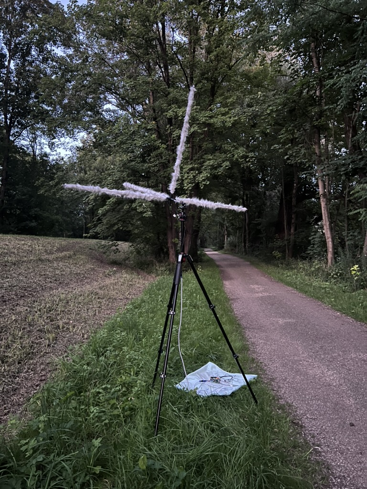

# Embedded Ultrasonics 

##  Open Source Microcontroller-Based Systems for Studying Echolocating Bats and Other Vocally Active Animals

## Overview

This repository contains the Arduino/ESP32 source code supporting the manuscript 

**"[Embedded Ultrasonics: A Microcontroller-Based Multichannel Ultrasound Recorder for Behavioural Field Studies](https://www.biorxiv.org/content/10.1101/2025.08.11.669530v1)"**

Preprint Available on BioRxiv at: [ https://doi.org/10.1101/2025.08.11.669530](https://www.biorxiv.org/content/10.1101/2025.08.11.669530v1)

Currently, it includes the following complementary systems:  

1. **Batsy4-Pro** – a Teensy 4.1–based multichannel ultrasonic recorder designed for high-fidelity capture of echolocation calls at up to 192 kHz.  
2. **Espertillio** – a heterodyning, recording & playback unit using an ESP32, capable of live monitoring, bat call playback, and SD card recording.  (Under further development)
3. **Esperdyne** - a heterodyning unit based on ESP32 with playback from an SD-stored `.wav` file.  (Under further development)

Together, these systems allow researchers to perform **field experiments** involving localisation, call analysis, and behavioural playback under natural foraging conditions.

More projects will be added as the systems are developed and tested. Check back again.


<p align="center">
  
  
</p>

---

## Features

### Batsy4-Pro

- Records **4 ultrasonic channels** at 192 kHz - extendable up to 8 analogue channels.
- Uses **PSRAM buffering**.
- Automatically generates unique WAV filenames.
- Provides **tunable live bat monitoring via heterodyning** for informed recording. No more guessing or additional monitoring equipment. 
- Designed for synchronised microphone array recordings.

### Espertillio

- **Heterodyne* real-time playback** for live bat monitoring.
- **FM/CF synthetic call playback** for behavioural tests.
- Records ultrasonic input to SD card as WAV files.
- Switchable between FM and CF playback modes via a physical toggle.
- Supports Doppler-shift simulation for moving targets with synthesised CF calls. (Experimental feature for future development)
- Currently developed for a single channel use - if that's all you need. This version is much cheaper than Teensy-based hardware. 

### Esperdyne

- Live **Heterodyne* monitoring**
- Play single-channel `.wav` from SD card - intended for testing and possible field experiments at any frequency band. Modify the `channels` variable to make it stereo-capable. 
- Output may be piped via power amplifiers and desired speakers. 

**[\* See the rotary encoder method in Batsy4-Pro for tunable carrier frequency. A fully implemented version will be available soon]** 

### Remote Trigger

- Batsy4-Pro may be combined with an ESP-NOW-based remote trigger. This simple yet effective module frees hands during field recordings. The system may be set up and monitored from a distance, and recordings may be remotely triggered. 
- You will need two ESP32 dev kits -- sender and receiver.
- I use an audio jack Bluetooth Plugin (e.g., [Avantree Relay](https://www.amazon.de/Avantree-Relay-Bluetooth-Headphones-Transmitter-black/dp/B0C3QQ4X6F/ref=sxin_15_pa_sp_search_thematic_sspa?content-id=amzn1.sym.91b38798-02f3-442f-871f-2fb966e28e5d%3Aamzn1.sym.91b38798-02f3-442f-871f-2fb966e28e5d&cv_ct_cx=airplay%2Badapter&keywords=airplay%2Badapter&pd_rd_i=B0C3QQ4X6F&pd_rd_r=ba66b95e-9919-4db9-867f-b0ac644b336e&pd_rd_w=Vdtpp&pd_rd_wg=jNmjS&pf_rd_p=91b38798-02f3-442f-871f-2fb966e28e5d&pf_rd_r=NBZ4DFX5T756JACNQE20&qid=1755449145&sbo=RZvfv%2F%2FHxDF%2BO5021pAnSA%3D%3D&sr=1-5-6e6ea531-5af4-4866-af75-1ef299d1c279-spons&sp_csd=d2lkZ2V0TmFtZT1zcF9zZWFyY2hfdGhlbWF0aWM&th=1)) to hear the heterodyned audio over Bluetooth headphones. This allows me to not be close to the setup and still be able to perform recordings. The BT addition has a perceptible delay, about 100ms or so, but immaterial for recording experiments.

---

## Hardware Requirements

### Batsy4Pro

- Teensy 4.1 microcontroller.
- Multiple ultrasonic microphones (e.g., Knowles MEMS series).
- SD card (high-speed, Class 10 recommended).
- APS6404L-3SQR PSRAM - 8MB (or equivalent)
- PCM5102A or similar DAC
- WM8782 I2S ADC
- Toggle buttons, rotary encoders etc (See code and BOM)

### Espertillio/Esperdyne

- ESP32 development board with I2S microphone and DAC output (e.g., PCM5102A).
- SD card breakout module.
- Buttons for playback and record control, and a mode toggle switch.
- Speaker or amplifier for output.
- Use the same ADC and Mics as above.

---

## Installation & Usage

1. **Clone this repository**:

   ```bash
   git clone git@github.com:raviumadi/Embedded_Ultrasonics.git
   ```

2. **Open each `.ino` file** in Arduino IDE.

3. **Install dependencies**:

   - For Teensy: [Teensyduino](https://www.pjrc.com/teensy/td_download.html)
   - For ESP32: Install `esp32` board support via Arduino Board Manager.

4. **Compile and upload** the appropriate firmware to your device.

5. **Connect hardware** according to the pin definitions in each `.ino` file.

6. **Run field tests** as described in the manuscript.

---

## Data Format

- All recordings are saved as **16-bit PCM WAV**.
- Filenames are automatically generated in the format:  
  - `REC###.WAV` for ESP32 recordings.
  - `BAT###.WAV` for Batsy4Pro recordings.
- Sampling rate: **192,000 Hz** (configurable in code).

---

## Related Resources

- [Teensy 4.1 Documentation](https://www.pjrc.com/store/teensy41.html)
- [i.MX RT1060 Processor Reference Manual R3](https://www.nxp.com/webapp/Download?colCode=IMXRT1060RM)
- [Teensy Audio Library](http://www.pjrc.com/teensy/td_libs_Audio.html)
- [WM8782 - 24-bit 192 kHz Stereo ADC Datasheet](https://statics.cirrus.com/pubs/proDatasheet/WM8782_v4.8.pdf) 
- [PCM510xA 2.1 VRMS, 112/106/100 dB Audio Stereo DAC with PLL and 32-bit, 384 kHz PCM Interface](https://www.ti.com/lit/ds/symlink/pcm5100a-q1.pdf?ts=1754321963376)
- [SPU0410LR5H-QB MEMS Microphones](https://mm.digikey.com/Volume0/opasdata/d220001/medias/docus/384/SPU0410LR5H-QB_RevH_3-27-13.pdf)
- [Inter-IC Sound (I2S) ESP32 Documentation](https://docs.espressif.com/projects/esp-idf/en/stable/esp32/api-reference/peripherals/i2s.html)
- [Arduino IDE](https://www.arduino.cc/en/software/)

## License

This project is licensed under the **Creative Commons Attribution–NonCommercial 4.0 International (CC BY-NC 4.0)**.  
See the `LICENSE` file for details.

---

## Disclaimer

The code in this repository is provided **"as is"**, without warranty of any kind.  
It is intended for **research and educational purposes only**.  
Use in environments involving wildlife should comply with local regulations and ethical guidelines.

## Commercial Development 

Please contact the author via https://biosonix.io if you are interested in developing commercial versions of the systems described here. 